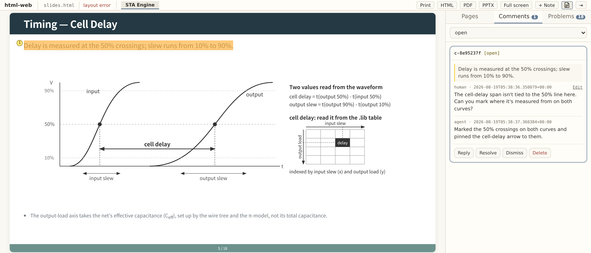

# html-mcp-web

Review an AI agent's HTML slides or report in your browser, point at the exact passage you mean, and let the agent read your comment and fix it over MCP.



The agent writes a self-contained HTML artifact. You open it in a local review page, select rendered text, and attach a comment. The agent reads the anchored quote and its surrounding context through MCP, edits the artifact, and replies in the same thread. Saving a file refreshes only the artifact frame, so your scroll position, draft comment, and sidebar stay put.

This follows the [HTML-artifact workflow described by Thariq Shihipar](https://claude.com/blog/using-claude-code-the-unreasonable-effectiveness-of-html) and adds a persistent pointing channel: highlights and comment threads go straight to the agent instead of being copied back into a prompt.

## What you get

- A browser review page for paged HTML: 16:9 **slides** or A4 **report**, one `section.page` per printed page.
- **Anchored comments** that survive edits by reattaching to the quote and its context.
- A **layout check** that flags content spilling off a page, clipped SVG drawings, and overlapping labels, all at the artifact's own scale.
- Export to **PDF** (headless Firefox) and an **editable PPTX** for slides.
- **Templates**: write a small content file and let a template supply the cover, bars, and page numbers.

## Requirements

- Python 3.10 or newer.
- Firefox, only if you want PDF or PPTX export.

## Install

```bash
git clone https://github.com/MiiKiyoshi/html-mcp-web.git
cd html-mcp-web
python -m venv .venv
.venv/bin/pip install -e '.[mcp]'
```

Register the MCP server with your agent once, using the executable inside the venv so it resolves without activation. Run this from the repository directory:

Claude Code:

```bash
claude mcp add --scope user html-mcp -- "$PWD/.venv/bin/html-mcp"
```

Codex:

```bash
codex mcp add html-mcp -- "$PWD/.venv/bin/html-mcp"
```

The `html-mcp-web` command (project setup) also lives in `.venv/bin`. Activate the venv (`source .venv/bin/activate`) when you run it, or call it by that path.

## Quickstart

Try the two shipped examples:

```bash
cd html-mcp-web/examples
# Start Claude Code or Codex here, with the html-mcp server enabled.
```

Ask the agent to call `inspect()`. The review page opens at [http://localhost:8766](http://localhost:8766); the top tabs switch between the neutral slides and neutral report projects. Select some text, press **Comment**, and ask the agent to process the comments.

## Set up your own artifact

In the directory that holds (or will hold) your artifact, initialize one project and pick a layout:

```bash
html-mcp-web init --layout slides --main artifact.html
```

Then ask the agent to call `inspect()`. Before setup it returns `setup_required` and stays connected; after `init` the same session starts the project server and the review page becomes available at the configured port. `init` writes `.html-mcp-web.yaml`:

```yaml
artifacts:
  slides:
    label: Slides
    layout: slides
    main: artifact.html
watch: ['*.html', '*.css', '*.js', '*.svg', '*.png', '*.jpg', '*.jpeg', '*.gif', '*.webp']
ignore: []
port: 8765
```

`artifacts` maps a stable id to its label, `layout` (`slides` or `report`), and `main` file. `watch` patterns refresh artifacts on save; `ignore` is checked first; `port` is the local server address. Several agent sessions that find the same config collaborate on one project: the first serves it, the rest share its server, comments, and revisions, and if the serving process exits another takes over on its next call.

## The review loop

Select text in the artifact and press **Comment**; the anchor stores the quote, nearby text, DOM path, and a digest so it can reattach after edits. The **Pages** tab lists each page's number and first heading. Your own messages carry an **Edit** link that rewrites them in place; agent messages are read-only. **Resolve** and **Dismiss** close a comment in one click.

Ask the agent, for example:

> Inspect and process the open html-mcp-web comments.

The MCP tools are:

- `inspect(artifact)`: project overview, or one artifact's paths, revision, build state, layout errors, and comment counts.
- `list_comments(artifact, status, unanswered, since)`: compact comment list; `unanswered=True` keeps threads whose latest entry is yours, `since=<ISO time>` keeps threads with a human entry after it, and each item carries `last_human_at` for the next call.
- `read_comments(artifact, comment_ids)`: full anchors and threads for chosen comments.
- `reply_comments(artifact, replies, edited_files)`: reply without changing status.
- `set_comment_status(artifact, comment_ids, status, message, edited_files)`: change status after verifying; message optional.
- `render_page(artifact, page, dpi, grayscale)`: render one page as an image for a visual check.
- `measure_space(artifact, page, revision, clearance, target, min_width, min_height)`: measure free space on a page or inside one block, in CSS pixels.
- `export_pptx(artifact, out)`: write a slides artifact as an editable pptx.

Editing or replying does not close a comment; a request is resolved only after its change is verified in the current artifact, while a question stays open after the reply. Comments live in `.html-mcp-web/comments/<artifact>.json`, which hold selected artifact text, so whether to track them in git is a privacy choice.

## Layout check

Anything outside a page, an inline `<svg>` whose shapes reach past its `viewBox`, an SVG that leaves a quarter of its box empty, and two labels printed over each other are reported with the page number in `inspect()`. Stroke and arrowheads at an edge, a label over a shape, and boxes that merely touch are left alone. The check runs at the artifact's fixed size, so the reported problems do not depend on your window size or zoom.

## Templates

A template compiles a small content file into the reviewed artifact so you edit content while the chrome (cover, bars, page numbers) stays consistent:

```bash
html-mcp-web init --layout slides --main slides.html --template neutral-slides --content content.html
```

html-mcp rebuilds on every content save; build failures show up as `build_error` in `inspect()`. A template is a directory `templates/<name>/` with a `build.py <content> <out>`. This repo ships [`templates/neutral-slides/`](templates/neutral-slides/) and [`templates/neutral-report/`](templates/neutral-report/); the content format is documented in [`templates/README.md`](templates/README.md). Your own templates go in `~/.config/html-mcp-web/templates/<name>/` and override a shipped template of the same name, so they stay out of this repository.

## Export

The review page's topbar exports each artifact as a file. **PDF** prints every page at the layout's fixed size through headless Firefox. **PPTX** (slides only) builds an editable deck and downloads it, also leaving a copy at `export/<artifact>.pptx`.

The pptx keeps each block where the html placed it: text becomes text boxes (with weight, colour, size, links, sub/superscripts, and `<code>` chips), `ul`/`ol` become bulleted and numbered lists, tables become pptx tables, images stay images, and a self-contained inline `<svg>` is embedded as real vector (crisp in PowerPoint 2016+ and Mac 2019+) with a screenshot fallback; KaTeX math stays a screenshot. A skin can name TrueType files to embed the deck font, and its `skin.json` `pptx` block can supply a template whose layouts carry the chrome; see [`templates/README.md`](templates/README.md#writing-a-skin).

## Configuration

Read or change the project config from the artifact directory:

```bash
html-mcp-web config                                  # print the whole config
html-mcp-web config artifacts.slides.layout report   # change one value
html-mcp-web config port 8766
html-mcp-web config watch '*.html,assets/**'
```

`init` flags: `--layout {slides,report}`, `--main <file>`, `--port <n>`, and `--template <name> --content <file>` for a templated artifact. The watcher re-reads `.html-mcp-web.yaml` after each save; artifact, template, watch, and ignore changes apply live, while a port change takes effect when the agent restarts.

## Security

An agent-generated artifact can run JavaScript with the local page's privileges. html-mcp-web is meant for trusted local artifacts and binds to `127.0.0.1` only.

## License

MIT; see [`LICENSE`](LICENSE).

## Acknowledgements

Full-screen wheel navigation adapts the intent-detection strategy from [Swiper's Mousewheel module](https://github.com/nolimits4web/swiper/blob/master/src/modules/mousewheel/mousewheel.mjs) by Vladimir Kharlampidi and the Swiper contributors, published under the [MIT License](https://github.com/nolimits4web/swiper/blob/master/LICENSE). It handles direction changes, rising input, separated wheel pulses, and decaying trackpad momentum so consecutive gestures stay responsive without one momentum tail skipping several slides.
