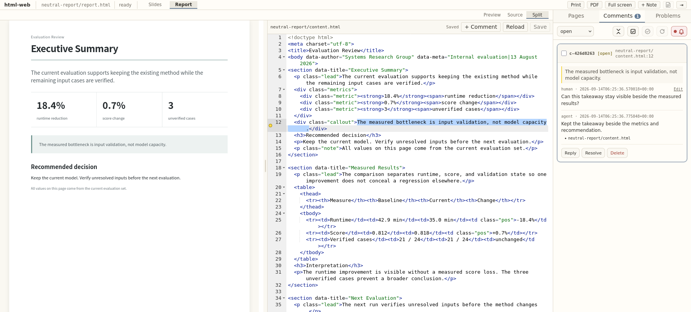
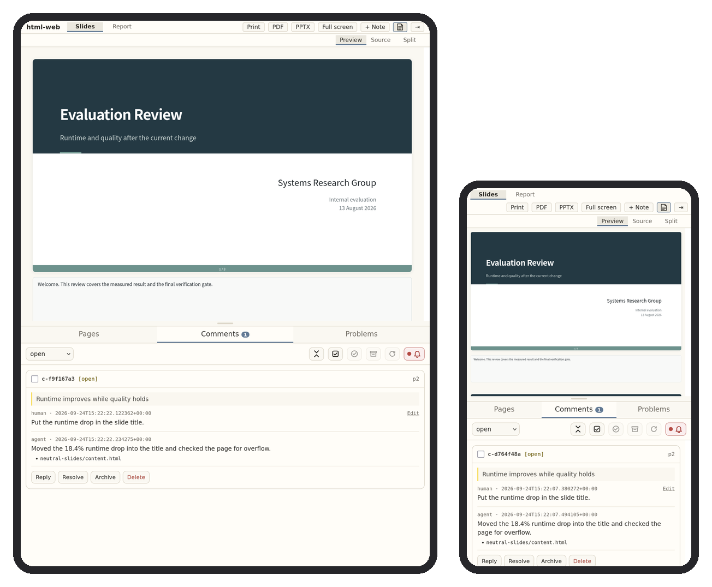

# html-mcp-web

Review an AI agent's HTML slides or report from the rendered page, on a desktop, tablet, or phone, while Claude Code or Codex edits the source.

**[Slides example](examples/neutral-slides/)**


**[Report example](examples/neutral-report/)**



You comment on the rendered page in your browser. The agent reads the comments, edits the
HTML, and replies in the same thread. Saving a file refreshes only the artifact frame, so
your scroll position and drafts stay put.

```
you:    select text -> write a comment -> press Call agent
                  |
agent:  read comments -> edit HTML -> reply
                  |
you:    read the refreshed page -> comment again
```

## Install

Paste this into Claude Code or Codex:

```
Install html-mcp-web by following https://raw.githubusercontent.com/MiiKiyoshi/html-mcp-web/main/INSTALL.md
```

The agent checks for Python and Firefox, shows you what it will install, and registers
html-mcp-web for every folder once you agree. Start the agent again afterwards.

## Init

Once per folder, start the agent in the folder that holds (or will hold) your artifact and say:

```
do html init
```

The agent asks whether it is slides (16:9) or a report (A4), proposes the file, a template,
and a free port, and writes `.html-mcp-web.yaml` once you agree.

## Listen

To review, say:

```
do html listen
```

Open `http://localhost:<port>` with the port you chose at init. Say it again after the
agent restarts; presses of **Call agent** made meanwhile wait for it.

## On a tablet or phone

The review page adapts to the screen: held upright, the comments dock below the artifact
and the bar between them drags with a finger. On a phone the comments start closed so the
slide has the screen; **⇥** opens them. On a touch screen the button that comments on
selected text sits clear of your finger.



The server listens on `127.0.0.1` only, so reach it from another device through a
forwarded port: an SSH tunnel, VS Code port forwarding, or `tailscale serve`.

## Reviewing

- **Preview**, **Source**, and **Split** show the rendered artifact, its source, or both;
  drag the divider to resize. A templated artifact shows its smaller content file.
- Select exact characters in either view and press **Comment**. Source comments reattach
  when the surrounding source moves.
- **+ Note** comments on the whole artifact, the **Pages** tab jumps between pages, and
  **Edit** fixes your own message.
- Press **Call agent** when your comments are ready.
- Resolving is yours: **Resolve** closes a thread. **Reference** sets one aside to read again;
  it still takes replies and returns with **Reopen** or **Resolve**.
- The page flags content off the page, clipped SVG drawings, and overlapping labels, and
  reports them to the agent.

Comments are stored in `.html-mcp-web/comments/<artifact>.json` and hold the text you
selected, so whether to track them in git is a privacy choice.

## Templates

A template builds the artifact from a small content file, so you edit content while the
cover, bars, and page numbers stay consistent. Pick one at init. This repo ships
[`templates/neutral-slides/`](templates/neutral-slides/) and
[`templates/neutral-report/`](templates/neutral-report/); the content format is in
[`templates/README.md`](templates/README.md). Your own templates go in
`~/.config/html-mcp-web/templates/<name>/`, and a writing guideline the agent follows in
`~/.config/html-mcp-web/guidelines/<name>/GUIDELINE.md`.

## Export

The topbar exports each artifact. **PDF** prints every page at the layout's fixed size
through headless Firefox. **PPTX** (slides only) builds an editable deck: text stays text,
tables stay tables, inline SVG stays vector, and math becomes an image. A skin can name
TrueType files to embed the deck font; see [`templates/SKINS.md`](templates/SKINS.md).

## Configuration

`.html-mcp-web.yaml` sits in the project folder. Ask the agent to change a field, or edit it.

| Field | Effect |
|---|---|
| `artifacts.<id>.layout` | `slides` (16:9) or `report` (A4). |
| `artifacts.<id>.main` | The HTML file the page shows; one `section.page` per printed page inside `main.pages`. |
| `artifacts.<id>.template`, `.content` | A template name and the content file it builds `main` from. |
| `guideline` | A guideline name under `~/.config/html-mcp-web/guidelines/`. |
| `watch`, `ignore` | Files whose saves refresh the page; `ignore` is checked first. |
| `port` | This folder's review page port. |

## Security

An agent-generated artifact runs JavaScript with the local page's privileges, so html-mcp-web is for trusted local artifacts and binds to `127.0.0.1` only.

## Acknowledgements

MIT licensed; see [`LICENSE`](LICENSE). The source editor uses [Ace](https://ace.c9.io/) under the BSD license; its license is included with the bundled files. Full-screen wheel navigation adapts the intent-detection strategy from [Swiper's Mousewheel module](https://github.com/nolimits4web/swiper/tree/master/src/modules/mousewheel) by Vladimir Kharlampidi and the Swiper contributors, under the MIT license.
