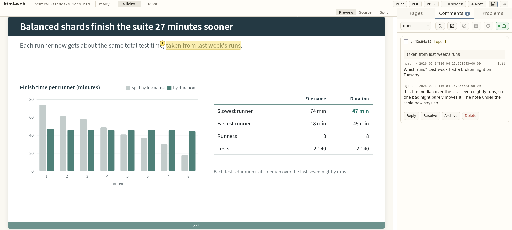
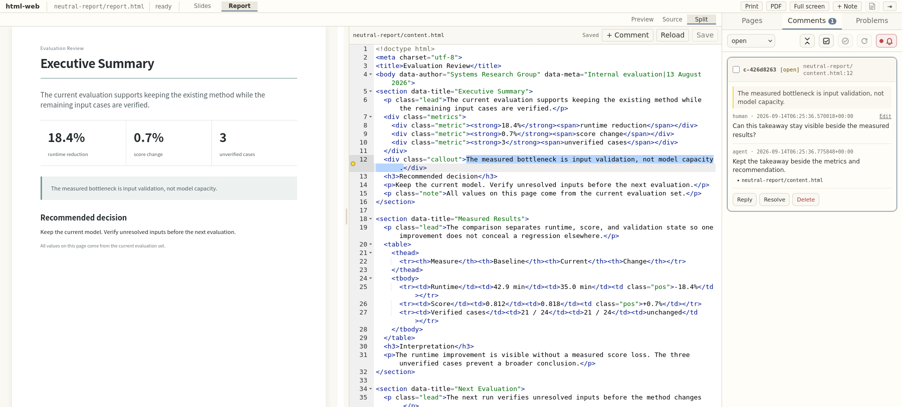
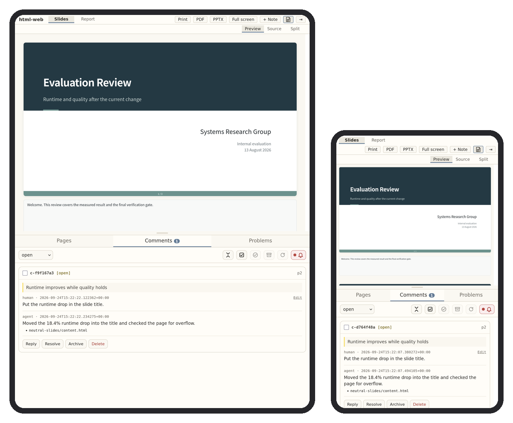

# html-mcp-web

Review an AI agent's HTML slides or report from the rendered page, on a desktop, tablet, or phone, while Claude Code or Codex edits the source. Hand the finished slides over as an editable PowerPoint deck.

> ⭐ **If this helps your reviews, please give it a star.** It helps others find the project.

**[Slides example](examples/neutral-slides/)**



**[Report example](examples/neutral-report/)**



## Install

Paste this into Claude Code or Codex:

```
Install html-mcp-web by following https://raw.githubusercontent.com/MiiKiyoshi/html-mcp-web/main/INSTALL.md
```

The agent checks for Python and Firefox, shows you what it will install, and installs once
you agree. Start the agent again afterwards.

## Init

Once per folder, start the agent in the folder that holds (or will hold) your artifact and say:

```
do html init
```

The agent proposes slides (16:9) with the neutral-slides template and the neutral writing
guideline, a file, and a free port, and writes `.html-mcp-web.yaml` once you agree. Ask for
the defaults to take them as they are, or name what to change, such as a report (A4).

## Listen

To review, say:

```
do html listen
```

Open `http://localhost:<port>` with the port you chose at init. Say it again after the
agent restarts.

## Reviewing

- Select text on the rendered page and press the **Comment** button beside it. **+ Note**
  comments on the whole artifact.
- Press **Call agent** when your comments are ready. The agent edits the source and replies
  in the same thread.
- **Resolve** a thread whose edit satisfies you, or **Reply** in it when it does not.
  **Archive** sets a thread aside, and it still takes replies.

## Suggested edits

The thread shows the source the agent would change as a −/+ pair, and the Source view marks
the same text in red. **Apply suggestion** writes the change into the file. Proposing again
replaces the proposal.

## Export to PowerPoint and PDF

Press **PPTX** in the topbar for an editable PowerPoint deck of the slides, or **PDF** to
print every page.

## On a tablet or phone



Forward the port you chose at init over SSH, from Termux on Android or iSH on iOS, then open
`http://localhost:<port>` in the phone's browser.

```
ssh -L <port>:localhost:<port> <server>
```

## Configuration

Edit `.html-mcp-web.yaml` in the project folder. A saved change applies at once, except
`port`, which applies when Claude Code or Codex restarts.

```yaml
artifacts:
  slides:
    label: Slides
    layout: slides
    main: slides.html
watch:
- '*.html'
- '*.css'
- '*.js'
- '*.svg'
- '*.png'
- '*.jpg'
- '*.jpeg'
- '*.gif'
- '*.webp'
ignore: []
port: 8765
```

| Field | Effect |
|---|---|
| `artifacts.<id>.label` | Name the review page shows for the artifact. |
| `artifacts.<id>.layout` | `slides` (16:9) or `report` (A4). |
| `artifacts.<id>.main` | The HTML file the page shows. |
| `artifacts.<id>.template`, `.content` | A template name and the content file it builds `main` from. |
| `guideline` | A writing guideline the agent follows, such as the built-in `neutral`. |
| `watch` | Files whose saves refresh the page. |
| `ignore` | Patterns excluded even when they match `watch`. |
| `port` | This folder's review page port. Any free port works. Init picks the first free one from 8765, so each folder can have its own. |

## Your own templates and guidelines

Put a template in `~/.config/html-mcp-web/templates/<name>/`. Start from a copy of
`templates/neutral-slides`, as [`templates/SKINS.md`](templates/SKINS.md) explains. Put a
writing guideline for the agent in `~/.config/html-mcp-web/guidelines/<name>/GUIDELINE.md`.
To build on the built-in [`neutral`](guidelines/neutral/GUIDELINE.md) guideline instead of
copying it, open your file with this front matter, write only the rules you add or change,
and say that yours win where the two differ:

```markdown
---
extends: neutral
---
```

A name you use replaces the built-in one of the same name. `do html init` offers both.

## Acknowledgements

MIT licensed. See [`LICENSE`](LICENSE). The source editor uses [Ace](https://ace.c9.io/) under the BSD license, and its license is included with the bundled files. Full-screen wheel navigation adapts the intent-detection strategy from [Swiper's Mousewheel module](https://github.com/nolimits4web/swiper/tree/master/src/modules/mousewheel) by Vladimir Kharlampidi and the Swiper contributors, under the MIT license.
